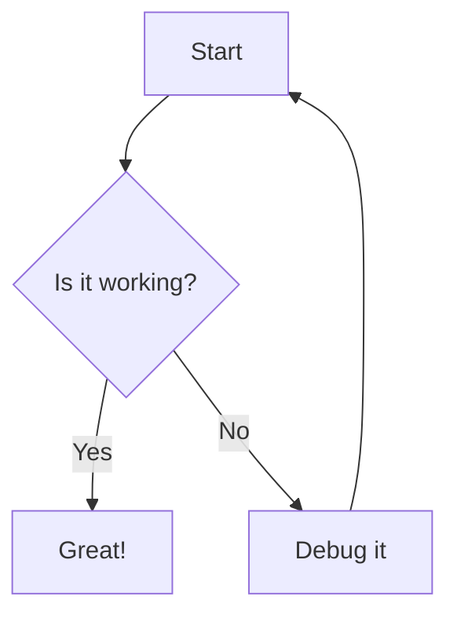

---
lab:
    topic: Mermaid test
    title: 'Mermaid rendering'
    description: ''
    level: 300
    duration: 20
---

# Mermaid rendering

Test

```mermaid
flowchart TD
    A[Start] --> B{Is it working?}
    B -- Yes --> C[Great!]
    B -- No --> D[Debug it]
    D --> A
```