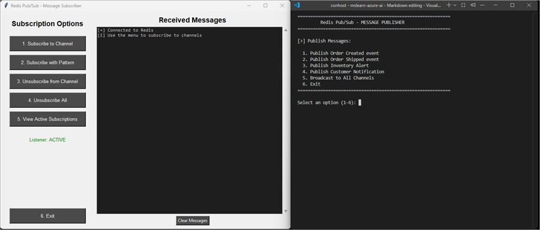

---
lab:
    topic: Azure Managed Redis
    title: 'Publish and subscribe to events in Azure Managed Redis'
    description: 'Learn how to build publisher and subscriber applications that implement pub/sub patterns in Azure Managed Redis using the redis-py Python library.'
---

# Publish and subscribe to events in Azure Managed Redis

In this exercise, you create an Azure Managed Redis resource and complete the code for a console-based publisher and a subscriber app. The publisher app sends event messages to Redis channels, while the subscriber app listens for those messages using a graphical interface built with **tkinter**. You implement core pub/sub patterns including direct channel subscriptions, wildcard pattern matching, message formatting, and background message listening.

Tasks performed in this exercise:

- Download the project starter files
- Create an Azure Managed Redis resource
- Add code to complete both the publisher and subscriber apps
- Run the publisher and subscriber apps to send and receive messages

This exercise takes approximately **40** minutes to complete.

## Before you start

To complete the exercise, you need:

- An Azure subscription. If you don't already have one, you can [sign up for one](https://azure.microsoft.com/).
- [Visual Studio Code](https://code.visualstudio.com/) on one of the [supported platforms](https://code.visualstudio.com/docs/supporting/requirements#_platforms).
- [Python 3.12](https://www.python.org/downloads/) or greater.
- The latest version of the [Azure CLI](/cli/azure/install-azure-cli?view=azure-cli-latest).
- The Azure CLI **redisenterprise** extension. You can install it by running the **az extension add --name redisenterprise** command.

## Download project starter files and deploy Azure Managed Redis

In this section you download the starter files for the console app and use a script to initialize the deployment of Azure Managed Redis to your subscription. The Azure Managed Redis deployment takes 5-10 minutes to complete.

1. Open a browser and enter the following URL to download the starter file. The file will be saved in your default download location.

    ```
    https://github.com/MicrosoftLearning/mslearn-azure-ai/raw/main/downloads/python/amr-pub-sub-python.zip
    ```

1. Copy, or move, the file to a location in your system where you want to work on the project. Then unzip the file into a folder.

1. Launch Visual Studio Code (VS Code) and select **File > Open Folder...** in the menu, then choose the folder containing the project files.

1. The project contains deployment scripts for both Bash (*azdeploy.sh*) and PowerShell (*azdeploy.ps1*). Open the appropriate file for your environment and change the two values at the top of script to meet your needs, then save your changes. **Note:** Do not change anything else in the script.

    ```
    "<your-resource-group-name>" # Resource Group name
    "<your-azure-region>" # Azure region for the resources
    ```

1. In the menu bar select **Terminal > New Terminal** to open a terminal window in VS Code.

1. Run the following command to login to your Azure account. Answer the prompts to select your Azure account and subscription for the exercise.

    ```
    az login
    ```

1. Run the following command to install the **redisenterprise** extension for Azure CLI.

    ```
    az extension add --name redisenterprise
    ```

1. Run the appropriate command in the terminal to launch the script. 

    **Bash**
    ```bash
    bash azdeploy.sh
    ```
    
    **PowerShell**
    ```powershell
    ./azdeploy.ps1
    ```

1. When the script is running, enter **1** to launch the **1. Create Azure Managed Redis resource** option.

    This option creates the resource group if it doesn't already exist, and starts a deployment of Azure Managed Redis. The process is completed as a background task in Azure.

1. After the following messages appear in the console, select **Enter** to return to the menu and then select **4** to exit the script. You run the script again later to check on the deployment status and also to create the *.env* file for the project.

    *The Azure Managed Redis resource is being created and takes 5-10 minutes to complete.*

    *You can check the deployment status from the menu later in the exercise.*


## Configure the Python environment

In this section, you create the Python environment and install the dependencies.

1. Run the following command in the VS Code terminal to create the Python environment.

    ```
    python -m venv .venv
    ```

1. Run the following command in the VS Code terminal to activate the Python environment. 

    **Bash**
    ```bash
    source .venv/Scripts/activate
    ```
    
    **PowerShell**
    ```powershell
    .venv\Scripts\Activate.ps1
    ```

    >**Note:** You may need to modify the commands for your environment. The *Scripts* folder may be *bin* depending on your operating system.

1. Run the following command in the VS Code terminal to install the dependencies.

    ```
    pip install -r requirements.txt
    ```

## Complete the publisher app

In this section you add code to the *publisher.py* script to complete the console app. You run the app later in the exercise after you complete the *subscriber.py* script and create the *.env* file.

1. Open the *publisher.py* file to begin adding code.

>**Note:** The code blocks you add to the application should align with the comment for that section of the code.

### Add the client connection

In this section, you add code to establish a connection to Azure Managed Redis using the redis-py library. The code retrieves connection credentials from environment variables and creates a Redis client instance configured for secure SSL communication.

1. Locate the **# BEGIN CONNECTION CODE SECTION** comment and add the following code under the comment. Be sure to check for proper code alignment.

    ```python
    def connect_to_redis() -> redis.Redis:
        """Establish connection to Azure Managed Redis using SSL encryption and authentication"""
        
        try:
            redis_host = os.getenv("REDIS_HOST")
            redis_key = os.getenv("REDIS_KEY")
            
            r = redis.Redis(
                host=redis_host,
                port=10000,
                ssl=True,
                decode_responses=True,
                password=redis_key,
                socket_timeout=30,
                socket_connect_timeout=30,
            )
            
            # Test connection
            r.ping()  # Verify Redis connectivity
            return r
            
        except redis.ConnectionError as e:
            print(f"[x] Connection error: {e}")
            print("Check if Redis host and port are correct, and ensure network connectivity")
            sys.exit(1)
        except redis.AuthenticationError as e:
            print(f"[x] Authentication error: {e}")
            print("Make sure the access key is correct")
            sys.exit(1)
        except Exception as e:
            print(f"[x] Unexpected error: {e}")
            sys.exit(1)
    ```

1. Save your changes.

### Add the publish message code

In this section, you add code to publish event messages to specific Redis channels using the **publish()** method. The publisher sends JSON-formatted messages containing event data such as order information. Each call to **publish()** returns the number of active subscribers that received the message, allowing you to verify the message was delivered. This is the core of the pub/sub pattern where the publisher doesn't need to know about individual subscribers.

1. Locate the **# BEGIN PUBLISH MESSAGE CODE SECTION** comment and add the following code under the comment. Be sure to check for proper code alignment.

    ```python
    def publish_order_created(r: redis.Redis) -> None:
        """Publish an order created event using r.publish() to the 'orders:created' channel"""
        clear_screen()
        print("=" * 60)
        print("Publishing: Order Created Event")
        print("=" * 60)
        
        order_data = {
            "event": "order_created",
            "order_id": f"ORD-{datetime.now().strftime('%Y%m%d%H%M%S')}",
            "customer": "Jane Doe",
            "total": 129.99,
            "timestamp": datetime.now().isoformat()
        }
        
        message = json.dumps(order_data)
        channel = "orders:created"
        
        # Publish message and get subscriber count
        subscribers = r.publish(channel, message)  # Send message to channel, returns number of subscribers that received it
        
        print(f"\n[>] Published to channel: '{channel}'")
        print(f"[#] Active subscribers: {subscribers}")
        print(f"\n[i] Message content:")
        print(json.dumps(order_data, indent=2))
        
        input("\n[+] Press Enter to continue...")
    ```

1. Save your changes.

### Add the broadcast message code

In this section, you add code to broadcast the same message to multiple channels simultaneously using a loop with **publish()**. Broadcasting is useful for system-wide announcements or events that need to reach subscribers across different channels. This demonstrates the one-to-many messaging capability of pub/sub, where a single message can efficiently reach all interested subscribers across multiple channels in real-time.

1. Locate the **# BEGIN BROADCAST CODE SECTION** comment and add the following code under the comment. Be sure to check for proper code alignment.

    ```python
    def broadcast_to_all(r: redis.Redis) -> None:
        """Broadcast a message to all channels using r.publish() in a loop for multi-channel delivery"""
        clear_screen()
        print("=" * 60)
        print("Broadcasting: System Announcement")
        print("=" * 60)
        
        announcement = {
            "event": "system_announcement",
            "message": "System maintenance scheduled for 2 AM",
            "priority": "high",
            "timestamp": datetime.now().isoformat()
        }
        
        channels = ["orders:created", "orders:shipped", "inventory:alerts", "notifications"]
        message = json.dumps(announcement)
        
        print(f"\n[>] Broadcasting to {len(channels)} channels...")
        print(f"Channels: {', '.join(channels)}\n")
        
        total_subscribers = 0
        for channel in channels:
            count = r.publish(channel, message)  # Send same message to multiple channels
            total_subscribers += count
            print(f"  - {channel}: {count} subscriber(s)")
        
        print(f"\n[#] Total subscribers reached: {total_subscribers}")
        print(f"\n[i] Message content:")
        print(json.dumps(announcement, indent=2))
        
        input("\n[+] Press Enter to continue...")
    ```

1. Save your changes.

### Review the code

Take a few minutes to review all of the code in the application.

## Complete the subscriber app

In this section you add code to the *subscriber.py* script to complete the console app. You run the app later in the exercise, after you confirm the Azure Managed Redis resource is fully deployed and create the **env** file.

1. Open the *subscriber.py* file to begin adding code.

>**Note:** The code blocks you add to the application should align with the comment for that section of the code.

### Add message formatting code

In this section, you add code to format incoming pub/sub messages for display in the subscriber application. The **format_message_gui()** function parses JSON payloads from published messages and extracts relevant fields based on the event type. This function handles both standard channel messages and pattern-matched messages, providing a consistent and readable display format for students to understand what data is being transmitted through the pub/sub system.

1. Locate the **# BEGIN MESSAGE FORMATTING CODE SECTION** comment and add the following code under the comment. Be sure to check for proper code alignment.

    ```python
    def format_message_gui(message_data: dict) -> str:
        """Format message data for GUI display, parsing JSON payload and extracting relevant fields"""
        timestamp = datetime.now().strftime("%H:%M:%S")
        channel = message_data.get('channel', 'unknown')
        
        try:
            data = json.loads(message_data['data'])
            event_type = data.get('event', 'unknown')
            
            formatted = f"[{timestamp}] Message on '{channel}'\n"
            formatted += f"{'─' * 50}\n"
            formatted += f"Event: {event_type}\n"
            
            # Display relevant fields based on event type
            if 'order_id' in data:
                formatted += f"Order ID: {data['order_id']}\n"
            if 'customer' in data:
                formatted += f"Customer: {data['customer']}\n"
            if 'total' in data:
                formatted += f"Total: ${data['total']}\n"
            if 'tracking_number' in data:
                formatted += f"Tracking: {data['tracking_number']}\n"
            if 'product_name' in data:
                formatted += f"Product: {data['product_name']}\n"
            if 'current_stock' in data:
                formatted += f"Stock Level: {data['current_stock']}\n"
            if 'message' in data:
                formatted += f"Message: {data['message']}\n"
            
            formatted += f"{'─' * 50}\n"
            return formatted
            
        except json.JSONDecodeError:
            return f"[{timestamp}] {channel}: {message_data['data']}\n"
    ```

1. Save your changes

### Add the message listener code

In this section, you add code for the background listener thread that continuously monitors subscribed channels for incoming messages. The **listen_messages()** method uses the blocking **pubsub.listen()** iterator to receive messages as they are published. This demonstrates how subscribers passively wait for messages and handle different message types (direct channel messages vs. pattern-matched messages). The listener runs in a background thread to avoid blocking the main application while still receiving real-time message updates.

1. Locate the **# BEGIN MESSAGE LISTENER CODE SECTION** comment and add the following code under the comment. Be sure to check for proper code alignment.

    ```python
    def listen_messages(self):
        """Background thread to listen for messages using pubsub.listen() blocking iterator"""
        self.listener_active = True
        
        try:
            for message in self.pubsub.listen():  # Listen for published messages (blocking)
                if not self.listening:
                    break
                    
                if message['type'] == 'message':
                    formatted = format_message_gui(message)
                    self.message_queue.put(formatted)
                    
                elif message['type'] == 'pmessage':
                    # Pattern-based subscription
                    timestamp = datetime.now().strftime("%H:%M:%S")
                    pattern = message['pattern']
                    channel = message['channel']
                    try:
                        data = json.loads(message['data'])
                        event_type = data.get('event', 'unknown')
                        msg = f"[{timestamp}] Pattern '{pattern}' matched '{channel}'\n"
                        msg += f"{'-' * 50}\n"
                        msg += f"Event: {event_type}\n"
                        msg += f"Full message: {json.dumps(data, indent=2)}\n"
                        msg += f"{'-' * 50}\n"
                        self.message_queue.put(msg)
                    except json.JSONDecodeError:
                        self.message_queue.put(f"[{timestamp}] Pattern '{pattern}': {message['data']}\n")
                        
        except Exception as e:
            if self.listening:
                self.message_queue.put(f"[x] Listener error: {e}\n")
        finally:
            self.listener_active = False
    ```

### Add code to subscribe to channels

In this section, you add code to handle channel and pattern subscriptions. The **subscribe_to_channel()** method registers interest in a specific channel using **pubsub.subscribe()**, while **subscribe_to_pattern()** uses **pubsub.psubscribe()** for wildcard pattern matching (e.g., "orders:*"). These functions demonstrate the two main subscription strategies in Redis pub/sub: direct channel subscriptions for specific events and pattern-based subscriptions for flexibility. After subscribing, the listener is restarted to begin receiving messages on the new channels.

1. Locate the **# BEGIN SUBSCRIBE CHANNEL/PATTERN CODE SECTION** comment and add the following code under the comment. Be sure to check for proper code alignment.

    ```python
    def subscribe_to_channel(self, channel: str) -> str:
        """Subscribe to a specific channel using pubsub.subscribe() for direct messaging"""
        try:
            self.pubsub.subscribe(channel)  # Subscribe to channel
            self.restart_listener()
            return f"[+] Subscribed to channel: '{channel}'"
        except Exception as e:
            return f"[x] Error subscribing: {e}"
    
    def subscribe_to_pattern(self, pattern: str) -> str:
        """Subscribe using a pattern with pubsub.psubscribe() for wildcard channel matching (e.g., 'orders:*')"""
        try:
            self.pubsub.psubscribe(pattern)  # Subscribe to pattern (e.g., 'orders:*')
            self.restart_listener()
            return f"[+] Subscribed to pattern: '{pattern}'"
        except Exception as e:
            return f"[x] Error subscribing: {e}"
    ```

1. Save your changes.

### Review the code

Take a few minutes to review all of the code in the application.

## Verify resource deployment

In this section you run the deployment script again to verify if the Azure Managed Redis deployment is completed, and create the *.env* file with the endpoint and access key values. 

1. Run the appropriate command in the terminal to start the deployment script. If you closed the previous terminal, select **Terminal > New Terminal** in the menu to open a new one.

    **Bash**
    ```bash
    bash azdeploy.sh
    ```
    
    **PowerShell**
    ```powershell
    ./azdeploy.ps1
    ```

1. When the deployment menu appears, enter **2** to run the **2. Check deployment status** option. If the status **Successful** returned proceed to the next step. If not, then wait a few minutes and try the option again.

1. After the deployment is complete, enter **3** to run the **3. Retrieve endpoint and access key** option. This will query the Azure Managed Redis resource and retrieve the endpoint and access key. It then creates the *.env* file with those values.

1. Review the *.env* file to verify the values are present, then enter **4** to exit the deployment script.

## Run the apps

In this section, you run the completed applications to send and receive messages. Both apps need to run at the same time, so you need to open two terminals. Both apps are menu-driven, and the *subscriber.py* app uses **tkinter** to create a GUI so you can more easily view messages and manage subscriptions. 

### Open two terminals

You need to ensure the Python environment is running in both terminals. Refer to the commands from earlier in the exercise to activate the environment if needed.

1. If you don't have a terminal open, select **Terminal > New Terminal** in the VS Code menu bar. Verify you are in the root folder of the project, and activate the Python environment if needed. This terminal is named **Terminal 1** in the rest of the exercise.

1. Open a second terminal by selecting **Ctrl + Shift + P** to bring up the VS Code commands and enter **Terminal: New Terminal Window**. This will open a terminal in a new window that you can reposition. Verify you are in the root folder of the project, and activate the Python environment if needed. This terminal is named **Terminal 2** in the rest of the exercise.

### Run the apps

1. Run the following command in **Terminal 2** to start the publisher app. After the app connects to Redis, press **Enter** to display the menu.

    ```
    python publisher.py
    ```

1. Run the following command in **Terminal 1** to start the subscriber app. The app will launch a new window with a GUI created with **tkinter**.

    ```
    python subscriber.py
    ```

1. Position both of the applications so they run side-by-side. 

    

### Send and receive messages

You need to first subscribe to a channel before you can receive messages.

1. In the subscriber app, select **1. Subscribe to Channel**. Enter **orders:created** in the channel name input box and select **Subscribe**.

    You should see a *Subscribed to channel: 'orders:created'* message  in the **Received Messages** area. Next you publish a message.

1. In the publisher app, enter **1** to to publish an order created event. You should see an event was published successfully to the channel. 

    ```
    [>] Published to channel: 'orders:created'
    [#] Active subscribers: 1
    
    [i] Message content:
    {
      "event": "order_created",
      "order_id": "ORD-20251120123114",
      "customer": "Jane Doe",
      "total": 129.99,
      "timestamp": "2025-11-20T12:31:14.906797"
    }
    ```

    The message should appear in the **Received Messages** section of the subscriber app.

    ```
    [12:31:14] Message on 'orders:created'
    ──────────────────────────────────────────────────
    Event: order_created
    Order ID: ORD-20251120123114
    Customer: Jane Doe
    Total: $129.99
    ──────────────────────────────────────────────────
    ```

1. In the publisher app, enter **2** to publish an **Order Shipped** event. The event will be sent, but it will not appear in the subscriber event because you only subscribed to the **orders:created** channel.

### Experiment with other subscription/publishing options

Take some time to experiment subscribing and publishing messages to different channels. Following is a table with details on each of the subscriber options:

| Subscriber Option | Description |
|--|--|
| Subscribe to Channel | Subscribes to a single channel. The channel options are listed in the dialog box. |
| Subscribe with Pattern | Subscribe to multiple channels. For example, subscribing with the **orders:*** pattern subscribes to all **orders** channels. |
| Unsubscribe from Channel | Unsubscribe from a single channel. Note: you can't unsubscribe using a pattern using this option. |
| Unsubscribe All | Unsubscribe from all channels, including pattern subscriptions. |
| View Active Subscriptions | Lists all of the subscribed channels, including pattern subscriptions. |

## Clean up resources

Now that you finished the exercise, you should delete the cloud resources you created to avoid unnecessary resource usage.

1. Run the following command in the VS Code terminal to delete the resource group, and all resources in the group. Replace **\<rg-name>** with the name you choose earlier in the exercise. The command will launch a background task in Azure to delete the resource group.

    ```
    az group delete --name <rg-name> --no-wait --yes
    ```

> **CAUTION:** Deleting a resource group deletes all resources contained within it. If you chose an existing resource group for this exercise, any existing resources outside the scope of this exercise will also be deleted.

## Troubleshooting

If you encounter issues while completing this exercise, try the following troubleshooting steps:

**Verify Azure Managed Redis resource deployment**
- Navigate to the [Azure portal](https://portal.azure.com) and locate your resource group.
- Confirm that the Azure Managed Redis resource shows a **Provisioning State** of **Succeeded**.
- Check that the resource has **Public network access** enabled and **Access keys authentication** set to **Enabled**.

**Check code completeness and indentation**
**Ensure all code blocks were added to the correct sections and between the appropriate BEGIN/END comment markers.
- Verify that Python indentation is consistent (use spaces, not tabs) and that all code aligns properly within functions.
- Confirm that no code was accidentally removed or modified outside the designated sections.

**Verify environment variables**
- Check that the *.env* file exists in the project folder and contains valid **REDIS_HOST** and **REDIS_KEY** values.
- Ensure the *.env* file is in the root of the project project.

**Check Python environment and dependencies**
- Confirm the virtual environment is activated before running the app.
- Verify that all packages from *requirements.txt* were installed successfully by running **pip list**.

