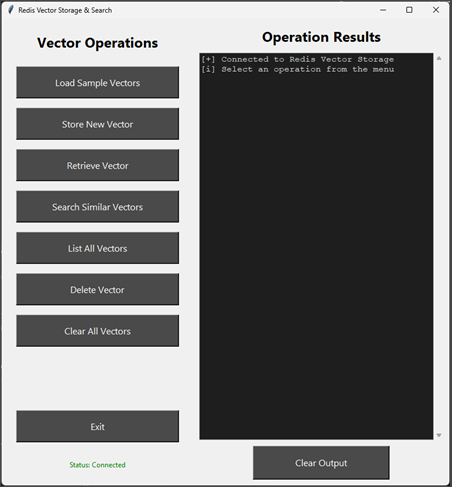

---
lab:
    topic: Azure Managed Redis
    title: 'Implement semantic search in Azure Managed Redis'
    description: 'Learn how to store product vectors with embeddings, create semantic search indexes, and perform similarity searches in Azure Managed Redis using redis-py and RediSearch.'
---

# Implement semantic search in Azure Managed Redis

In this exercise, you create an Azure Managed Redis resource and complete the code for a vector storage application. The application loads sample product data with embeddings, stores new products with vector embeddings and metadata, performs semantic similarity searches using vector embeddings, and displays related products based on cosine similarity. You implement core vector operations including storing vectors as binary data with metadata, creating a RediSearch index with HNSW algorithm configuration, and executing KNN queries to find semantically similar products.

Tasks performed in this exercise:

- Download the project starter files
- Create an Azure Managed Redis resource
- Add code to complete business logic
- Run the app to load sample data, store products with embeddings, and perform similarity searches

This exercise takes approximately **40** minutes to complete.

## Before you start

To complete the exercise, you need:

- An Azure subscription with the permission to create an Azure Managed Redis instance with an enterprise SKU. If you don't already have one, you can [sign up for one](https://azure.microsoft.com/).
- [Visual Studio Code](https://code.visualstudio.com/) on one of the [supported platforms](https://code.visualstudio.com/docs/supporting/requirements#_platforms).
- [Python 3.12](https://www.python.org/downloads/) or greater.
- The latest version of the [Azure CLI](/cli/azure/install-azure-cli?view=azure-cli-latest).
- The Azure CLI **redisenterprise** extension. You can install it by running the **az extension add --name redisenterprise** command.

## Download project starter files and deploy Azure Managed Redis

In this section you download the starter files for the app and use a script to initialize the deployment of Azure Managed Redis to your subscription. The Azure Managed Redis deployment takes 5-10 minutes to complete.

1. Open a browser and enter the following URL to download the starter file. The file will be saved in your default download location.

    ```
    https://github.com/MicrosoftLearning/mslearn-azure-ai/raw/main/downloads/python/amr-vector-query-python.zip
    ```

1. Copy, or move, the file to a location in your system where you want to work on the project. Then unzip the file into a folder.

1. Launch Visual Studio Code (VS Code) and select **File > Open Folder...** in the menu, then choose the folder containing the project files.

1. The project contains deployment scripts for both Bash (*azdeploy.sh*) and PowerShell (*azdeploy.ps1*). Open the appropriate file for your environment and change the two values at the top of script to meet your needs, then save your changes. **Note:** Do not change anything else in the script.

    ```
    "<your-resource-group-name>" # Resource Group name
    "<your-azure-region>" # Azure region for the resources
    ```

1. In the menu bar select **Terminal > New Terminal** to open a terminal window in VS Code.

1. Run the following command to login to your Azure account. Answer the prompts to select your Azure account and subscription for the exercise.

    ```
    az login
    ```

1. Run the following command to install the **redisenterprise** extension for Azure CLI.

    ```
    az extension add --name redisenterprise
    ```

1. Run the appropriate command in the terminal to launch the script.

    **Bash**
    ```bash
    bash azdeploy.sh
    ```

    **PowerShell**
    ```powershell
    ./azdeploy.ps1
    ```

1. When the script is running, enter **1** to launch the **1. Create Azure Managed Redis resource** option.

    This option creates the resource group if it doesn't already exist, and starts a deployment of Azure Managed Redis. The process is completed as a background task in Azure.

1. After the following messages appear in the console, select **Enter** to return to the menu and then select **4** to exit the script. You run the script again later to check on the deployment status and also to create the *.env* file for the project.

    *The Azure Managed Redis resource is being created and takes 5-10 minutes to complete.*

    *You can check the deployment status from the menu later in the exercise.*


## Configure the Python environment

In this section, you create the Python environment and install the dependencies.

1. Run the following command in the VS Code terminal to create the Python environment.

    ```
    python -m venv .venv
    ```

1. Run the following command in the VS Code terminal to activate the Python environment.

    **Bash**
    ```bash
    source .venv/Scripts/activate
    ```

    **PowerShell**
    ```powershell
    .venv\Scripts\Activate.ps1
    ```

    >**Note:** You may need to modify the commands for your environment. The *Scripts* folder may be *bin* depending on your operating system.

1. Run the following command in the VS Code terminal to install the dependencies.

    ```
    pip install -r requirements.txt
    ```

## Complete the manage vector app

In this section you add code to the *manage_vector.py* script to complete the app. You run the app later in the exercise, after you confirm the Azure Managed Redis resource is fully deployed and create the *.env* file.

1. Open the *manage_vector.py* file to begin adding code.

>**Note:** The code blocks you add to the application should align with the comment for that section of the code.

### Add the initialization and connection code

In this section, you add code to establish a connection to Azure Managed Redis using redis-py. The **_connect_to_redis()** function uses the redis-py **Redis** class to create a secure SSL connection with authentication. The **__init__()** method initializes the vector index for semantic search operations.

1. Locate the **# BEGIN INITIALIZATION AND CONNECTION CODE SECTION** comment and add the following code under the comment. Be sure to check for proper code alignment.

    ```python
    def __init__(self):
        """Initialize the product manager and establish Redis connection"""
        self.r = self._connect_to_redis()
        self._create_vector_index()  # Create RediSearch index for product embeddings
        self.VECTOR_DIM = 8  # Product embedding dimensionality (matches sample_data.json)

    def _connect_to_redis(self) -> redis.Redis:
        """Establish connection to Azure Managed Redis using SSL encryption and authentication"""
        try:
            # Get connection parameters from environment variables
            redis_host = os.getenv("REDIS_HOST")
            redis_key = os.getenv("REDIS_KEY")

            # Create Redis connection with SSL and authentication
            r = redis.Redis(
                host=redis_host,
                port=10000,  # Azure Managed Redis uses port 10000
                ssl=True,  # Use SSL encryption
                decode_responses=False,  # Keep binary for embeddings - only decode text when needed
                password=redis_key,  # Authentication key
                db=0,  # Connect to database 0 (the default database with RediSearch module)
                socket_timeout=30,  # Connection timeout
                socket_connect_timeout=30,  # Socket timeout
            )

            # Test connection
            r.ping()  # Verify Redis connectivity
            return r

        except redis.ConnectionError as e:
            raise Exception(f"Connection error: {e}")
        except redis.AuthenticationError as e:
            raise Exception(f"Authentication error: {e}")
        except Exception as e:
            raise Exception(f"Unexpected error: {e}")
    ```

1. Save your changes.

### Add the create vector index code

In this section, you add code to create a RediSearch index for vector similarity search using the redis-py search module. The **_create_vector_index()** function defines the schema with text fields and a VectorField configured for HNSW (Hierarchical Navigable Small World) indexing with cosine similarity, enabling efficient semantic search operations.

1. Locate the **# BEGIN CREATE VECTOR INDEX CODE SECTION** comment and add the following code under the comment. Be sure to check for proper code alignment.

    ```python
    def _create_vector_index(self):
        """Create a RediSearch index for product semantic search using HNSW algorithm"""
        try:
            # Define schema with embedding field for HNSW-based product similarity search
            # DIM=8 matches our sample data dimensions (in production, this would match your embedding model's output)
            schema = (
                TextField("name"),
                TextField("category"),
                TextField("product_id"),
                VectorField(
                    "embedding",
                    "HNSW",  # Hierarchical Navigable Small World - fast approximate search
                    {
                        "TYPE": "FLOAT32",           # Standard for embeddings
                        "DIM": 8,                    # Must match embedding dimensions in sample_data.json
                        "DISTANCE_METRIC": "COSINE"  # Cosine similarity for semantic search
                    }
                )
            )

            # Create index on hash keys starting with "product:"
            definition = IndexDefinition(
                prefix=["product:"],
                index_type=IndexType.HASH
            )
            self.r.ft("idx:products").create_index(
                fields=schema,
                definition=definition
            )
        except redis.ResponseError as e:
            if "already exists" in str(e):
                pass  # Index already exists, which is fine
            else:
                raise Exception(f"Error creating vector index: {str(e)}")
        except Exception as e:
            raise Exception(f"Error creating vector index: {str(e)}")
    ```

1. Save your changes.

### Add the store product code

In this section, you add code to store products with vector embeddings and metadata using Redis. The **store_product()** function uses numpy to convert embedding arrays to binary float32 bytes, then uses the redis-py **hset()** method to store the binary embedding and metadata fields in a Redis hash structure. This approach provides efficient storage and retrieval of vector data.

1. Locate the **# BEGIN STORE PRODUCT CODE SECTION** comment and add the following code under the comment. Be sure to check for proper code alignment.

    ```python
    def store_product(self, vector_key: str, vector: list, metadata: dict = None) -> tuple[bool, str]:
        """Store a product with embedding in Redis using hash data structure with binary embedding storage"""
        try:
            # Convert embedding to binary bytes using numpy for efficient storage
            # This follows redis-py best practices for storing embeddings
            embedding = np.array(vector, dtype=np.float32)
            data = {"embedding": embedding.tobytes()}  # Store embedding as binary bytes

            # Add metadata fields to the hash
            if metadata:
                for key, value in metadata.items():
                    data[key] = str(value)

            # Store the hash in Redis using hset() method
            result = self.r.hset(vector_key, mapping=data)

            if result > 0:
                return True, f"Product stored successfully under key '{vector_key}'"
            else:
                return True, f"Product updated successfully under key '{vector_key}'"

        except Exception as e:
            return False, f"Error storing product: {e}"
    ```

1. Save your changes.

### Add the search similar products vector code

In this section, you add code to perform vector similarity search using RediSearch with the redis-py client. The **search_similar_products()** function uses numpy to convert the query vector to binary float32 bytes, then executes a KNN (k-nearest neighbors) query against the RediSearch index to find the most similar products based on cosine similarity of their embeddings.

1. Locate the **# BEGIN SEARCH SIMILAR PRODUCTS CODE SECTION** comment and add the following code under the comment. Be sure to check for proper code alignment.

    ```python
    def search_similar_products(self, query_vector: list, top_k: int = 3) -> tuple[bool, list | str]:
        """Search for products similar to the query vector using RediSearch KNN queries"""
        try:
            # Convert query vector to binary bytes for KNN search
            query_bytes = np.array(query_vector, dtype=np.float32).tobytes()

            # Build KNN query using RediSearch vector search syntax for semantic similarity
            # *=>[KNN k @field_name $query_vec] finds k most similar products based on embedding distance
            knn_query = (
                Query(f"*=>[KNN {top_k} @embedding $query_vec AS score]")
                .return_fields("name", "category", "product_id", "score")
                .sort_by("score")
                .dialect(2)  # Dialect 2 enables vector search syntax
            )

            # Execute KNN search with query vector as parameter
            results = self.r.ft("idx:products").search(
                knn_query,
                query_params={"query_vec": query_bytes}
            )

            if results.total == 0:
                return False, "No products found in Redis. Ensure products are loaded and RediSearch module is enabled."

            # Format results
            similarities = []
            for doc in results.docs:
                similarities.append({
                    "key": doc.id,
                    "similarity": float(doc.score),
                    "product_id": doc.product_id.decode() if isinstance(doc.product_id, bytes) else doc.product_id,
                    "name": doc.name.decode() if isinstance(doc.name, bytes) else doc.name,
                    "category": doc.category.decode() if isinstance(doc.category, bytes) else doc.category
                })

            return True, similarities

        except Exception as e:
            return False, f"Error searching products: {e}"
    ```

1. Save your changes.

### Review the code

Take a few minutes to review all of the code in the *manage_vector.py* file.

## Verify resource deployment

In this section you run the deployment script again to verify if the Azure Managed Redis deployment is completed, and create the *.env* file with the endpoint and access key values.

1. Run the appropriate command in the terminal to start the deployment script. If you closed the previous terminal, select **Terminal > New Terminal** in the menu to open a new one.

    **Bash**
    ```bash
    bash azdeploy.sh
    ```

    **PowerShell**
    ```powershell
    ./azdeploy.ps1
    ```

1. When the deployment menu appears, enter **2** to run the **2. Check deployment status** option. If the status shows **Successful**, proceed to the next step. If not, then wait a few minutes and try the option again.

1. After the deployment is complete, enter **3** to run the **3. Enable access key auth and retrieve endpoint and access key** option. This will query the Azure Managed Redis resource and retrieve the endpoint and access key. It then creates the *.env* file with those values.

1. Review the *.env* file to verify the values are present, then enter **4** to exit the deployment script.

## Run the app

In this section, you run the completed application and practice loading, storing, and searching vector data. The app uses **tkinter** to create a GUI so you can more easily view and manage data.

1. Run the following command in the terminal to start the app. Refer to the commands from earlier in the exercise to activate the environment, if needed, before running the command.

    ```
    python vectorapp.py
    ```

    The app should look similar to the following image:

    

> **Note:** All of the steps in this section are performed in the app.

### Load sample data and perform a similarity search

In this section, you practice loading sample vector data into Redis and then performing a similarity search. You practice retrieving a known vector and using it as a query to find semantically related products in your database.

1. Select **Load Sample Products**. The status of the load operation will appear in **Operation Results**.

1. Select **List All Products** to display the sample data. The sample data is listed showing the: Key, Name, Category, and Embedding for the products in the sample data.

1. Select **Find Similar Products** and enter `product:001` in the **Product Key:** input field, then select **Search**.

    A list of similar products is returned with the product information and the similarity score.

### Store a new product and perform a similarity search


1. Select **Store New Product** and enter the following information in the form, then select **Store Product**. Review the operation results.

    Product Key:

    ```
    product:011
    ```

    Embedding:

    ```
    [0.53, 0.63, 0.58, 0.37, 0.68, 0.47, 0.73, 0.57]
    ```

    Metadata:

    ```
    product_id=011
    name=Gym Bag
    category=Sports
    ```

    > **Note:** You can also edit any data record by entering that record's product key in the **Store New Product** form and changing the other fields.

1. Select **Find Similar Products** and enter `product:009` in the **Product Key:** input field, then select **Search**.

    Review the output and notice the Gym Bag is now the product most similar to the Premium Backpack.

## Clean up resources

Now that you finished the exercise, you should delete the cloud resources you created to avoid unnecessary resource usage.

1. Run the following command in the VS Code terminal to delete the resource group, and all resources in the group. Replace **\<rg-name>** with the name you choose earlier in the exercise. The command will launch a background task in Azure to delete the resource group.

    ```
    az group delete --name <rg-name> --no-wait --yes
    ```

> **CAUTION:** Deleting a resource group deletes all resources contained within it. If you chose an existing resource group for this exercise, any existing resources outside the scope of this exercise will also be deleted.

## Troubleshooting

If you encounter issues while completing this exercise, try the following troubleshooting steps:

**Verify Azure Managed Redis resource deployment**
- Navigate to the [Azure portal](https://portal.azure.com) and locate your resource group.
- Confirm that the Azure Managed Redis resource shows a **Provisioning State** of **Succeeded**.
- Check that the resource has **Public network access** enabled and **Access keys authentication** set to **Enabled**.

**Check code completeness and indentation**
- Ensure all code blocks were added to the correct sections and between the appropriate BEGIN/END comment markers.
- Verify that Python indentation is consistent (use spaces, not tabs) and that all code aligns properly within functions.
- Confirm that no code was accidentally removed or modified outside the designated sections.

**Verify environment variables**
- Check that the *.env* file exists in the project folder and contains valid **REDIS_HOST** and **REDIS_KEY** values.
- Ensure the *.env* file is in the root of the project.

**Check Python environment and dependencies**
- Confirm the virtual environment is activated before running the app.
- Verify that all packages from *requirements.txt* were installed successfully by running **pip list**.

